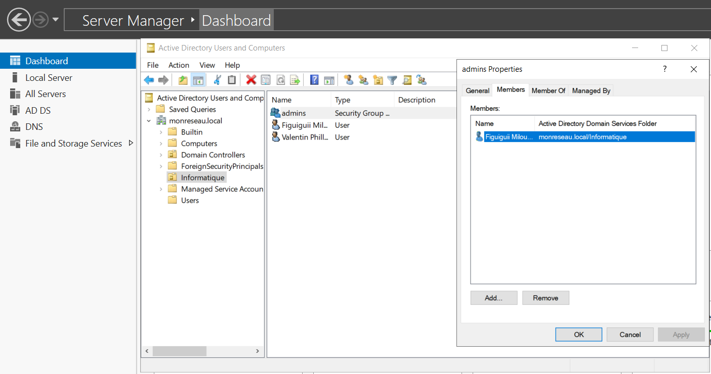

# Projet Active Directory - Windows Server

## Objectif
Mettre en place un environnement Active Directory fonctionnel, avec :

- Un domaine Windows (`monreseau.local`)
- Une Unité d’Organisation `Informatique`
- Un groupe `admins`
- Deux utilisateurs (`Figuiguii.Miloudd`, `Valentin.Phillips`)

## Prérequis
- Windows Server 2019 ou 2022 (VMware)
- Rôle AD DS installé
- Nom d’hôte propre (ex: `srv-ad.monreseau.local`)
- Compte administrateur

## Structure du dépôt
```
active-directory-projet/
├── captures/
│ ├── AD-installation.png
│ ├── ou-structure.png
│ └── user-creation.png
├── scripts/
│ └── create-users.ps1
├── README.md         
```

---
## Aperçu



## Automatisation

Le dossier `scripts/` contient un script PowerShell pour automatiser :

- La création de l’OU
- La création des utilisateurs
- L’ajout au groupe `Admins`

